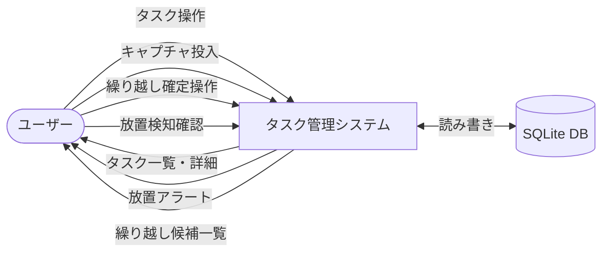
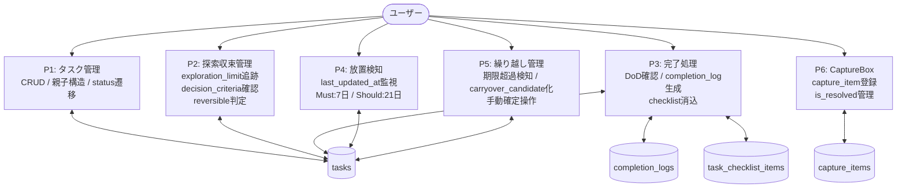
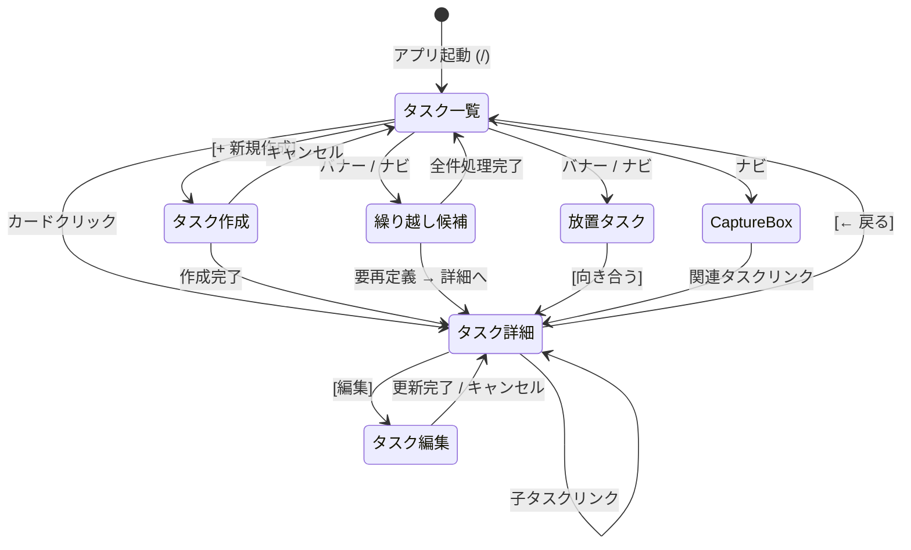
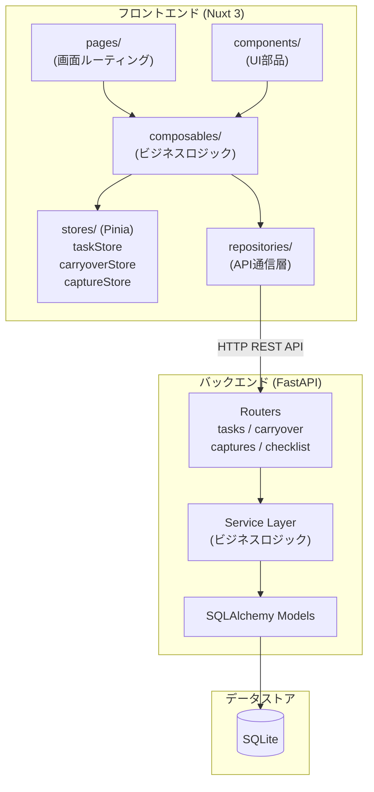
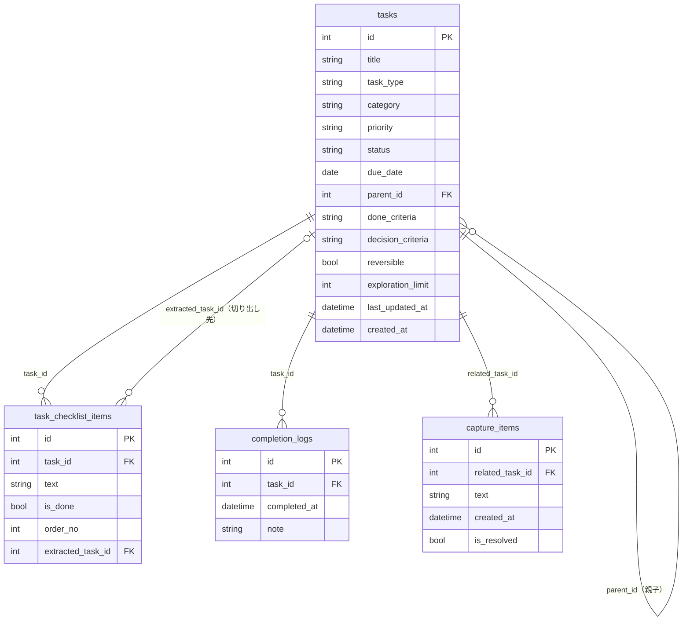

# タスク管理システム 設計概要書

バージョン: 1.0 | 作成日: 2026-02-26

---

## 目次

1. [DFD（データフロー図）](#1-dfdデータフロー図)
2. [画面遷移図](#2-画面遷移図)
3. [採用技術選定](#3-採用技術選定)
4. [アーキテクチャ構成設計](#4-アーキテクチャ構成設計)
5. [外部IF設計](#5-外部if設計)
6. [テスト設計](#6-テスト設計)
7. [運用設計](#7-運用設計)
8. [監視設計](#8-監視設計)

---

## 1. DFD（データフロー図）

### 1.1 目的

システム内のデータの流れを可視化し、プロセスとデータストアの関係を明確にする。

### 1.2 スコープ

v0.1スコープ。外部システム連携・チーム共有・通知機能は対象外。

### 1.3 レベル0（コンテキスト図）



### 1.4 レベル1（主要プロセス分解）



### 1.4 制約・前提条件

- 外部エンティティはユーザーのみ（単一ユーザー前提）
- `carryover_candidate` および `stale` はDBステータスではなく動的計算で判定

---

## 2. 画面遷移図

### 2.1 目的

画面間のナビゲーションフローを可視化し、ルーティング設計の根拠とする。

### 2.2 スコープ

Nuxt 3 pagesディレクトリで管理される全画面。

### 2.3 遷移図



### 2.4 画面一覧サマリー

| 画面 | パス | 役割 |
|------|------|------|
| タスク一覧 | `/` | メイン画面。放置・繰り越しバナー通知 |
| タスク作成 | `/tasks/new` | 新規登録フォーム |
| タスク詳細 | `/tasks/[id]` | 詳細・チェックリスト・子タスク・CaptureBox |
| タスク編集 | `/tasks/[id]/edit` | 編集フォーム |
| 繰り越し候補 | `/carryover` | 期限超過タスクの4アクション処理 |
| 放置タスク | `/stale` | Must/Shouldセクション別表示 |
| CaptureBox | `/capture` | 分岐論点の投入・解決済み管理 |

### 2.5 制約・前提条件

- 認証画面はv0.1スコープ外
- モバイル対応は将来拡張

---

## 3. 採用技術選定

### 3.1 目的

要件に基づき技術スタックを選定し、選定理由を記録する。

### 3.2 スコープ

v0.1のフロントエンド・バックエンド・DB・開発環境。

### 3.3 技術スタック一覧

| レイヤー | 採用技術 | 選定理由 |
|---------|---------|---------|
| フロントエンド | Nuxt 3 | Vue 3ベースのフルスタックフレームワーク。ファイルベースルーティングにより画面追加が容易 |
| UIライブラリ | Nuxt UI（Tailwindベース） | Nuxt公式UI。Tailwindとの親和性が高く、デザイン一貫性を保ちやすい |
| 状態管理 | Pinia | Vue 3公式推奨。軽量でTypeScriptサポートが優秀。Vuexより記述量が少ない |
| API通信 | Repositoryパターン（$fetch） | 通信層とビジネスロジック層を分離。テスタビリティ・保守性が高い |
| 言語 | TypeScript | 型安全により実行前のバグ検出が可能。複雑なタスク状態管理に適している |
| バックエンド | FastAPI（Python） | 型ヒント・自動OpenAPI生成・非同期対応。SQLAlchemy連携が容易 |
| DB | SQLite | 単一ユーザー前提のシンプル構成。ファイルベースで環境依存なし |
| ORM/マイグレーション | SQLAlchemy + Alembic | FastAPIとの組み合わせがデファクト。将来のRDB移行も容易 |

### 3.4 将来拡張時の技術移行方針

| 現在 | 移行先 | トリガー |
|------|-------|---------|
| SQLite | PostgreSQL / MySQL | チーム共有・データ量増加時 |
| 認証なし | JWT認証 | マルチユーザー化時 |
| ローカル起動 | Docker + クラウドデプロイ | 可用性要件が生まれた時 |

### 3.5 制約・前提条件

- チーム共有・外部連携・通知はv0.1対象外のため、対応する技術選定はTBD

---

## 4. アーキテクチャ構成設計

### 4.1 目的

システム全体の構成を可視化し、各コンポーネントの責務と関係を明確にする。

### 4.2 スコープ

v0.1のローカル動作環境。インフラ・クラウドはスコープ外。

### 4.3 全体構成図



### 4.4 呼び出しフロー

```
pages/components
  → composables（ビジネスロジック・エラーハンドリング）
    → repositories（HTTP通信のみ）
      → FastAPI Routers
        → Service Layer（DB操作・バリデーション）
          → SQLAlchemy Models
            → SQLite
```

### 4.5 ディレクトリ構成概要

**フロントエンド（frontend/）**

```
pages/          # ルーティング（index, tasks/[id], carryover, stale, capture）
components/     # task/, checklist/, carryover/, capture/, common/
composables/    # useTask, useChecklist, useCarryover, useStale, useCapture
stores/         # taskStore, carryoverStore, captureStore
repositories/   # taskRepository, checklistRepository, carryoverRepository, captureRepository
types/          # Task, Checklist, Carryover, Capture
utils/          # staleThreshold.ts（放置判定）, dateFormat.ts
```

**バックエンド（backend/）**

```
routers/        # tasks.py, carryover.py, captures.py, checklist.py
services/       # task_service.py, carryover_service.py, capture_service.py
models/         # task.py, completion_log.py, checklist_item.py, capture_item.py
schemas/        # Pydantic スキーマ
db/             # database.py（セッション管理）, migrations/（Alembic）
```

### 4.6 制約・前提条件

- フロントエンドとバックエンドは別プロセスで起動（ポート分離）
- CORS設定はローカル開発環境前提（本番化時に要見直し）
- 単一ユーザー前提のためセッション管理は不要

---

## 5. 外部IF設計

### 5.1 目的

フロントエンド・バックエンド間のAPIインターフェースを定義する。

### 5.2 スコープ

v0.1。外部サービス連携はスコープ外。

### 5.3 API全体方針

- RESTful設計（独立パス方式）
- レスポンス形式：JSON
- `stale` / `carryover_candidate` は動的計算（DBステータス変更なし）
- `POST /tasks/{id}/complete` 経由のみ `done` に遷移可能（PATCH経由禁止）

### 5.4 エンドポイント一覧

**タスク管理（P1）**

| メソッド | パス | 説明 |
|---------|------|------|
| GET | `/tasks` | 一覧取得（status/typeフィルタ） |
| POST | `/tasks` | タスク登録 |
| GET | `/tasks/{id}` | 詳細取得（子タスク・チェックリスト含む） |
| PATCH | `/tasks/{id}` | 部分更新 |
| DELETE | `/tasks/{id}` | 削除 |
| GET | `/tasks/{id}/children` | 子タスク一覧 |
| POST | `/tasks/{id}/children` | 子タスク登録 |

**探索収束（P2）**

| メソッド | パス | 説明 |
|---------|------|------|
| GET | `/tasks/{id}/convergence` | 探索収束状態確認 |

**完了処理（P3）**

| メソッド | パス | 説明 |
|---------|------|------|
| POST | `/tasks/{id}/complete` | タスク完了（completion_log生成） |
| GET | `/tasks/{id}/completion-log` | 完了ログ取得 |
| GET | `/tasks/{id}/checklist` | チェックリスト取得 |
| PATCH | `/tasks/{id}/checklist/{item_id}` | チェックリストアイテム更新 |
| POST | `/tasks/{id}/checklist/{item_id}/extract` | アイテムをタスクとして切り出す |

**放置検知（P4）**

| メソッド | パス | 説明 |
|---------|------|------|
| GET | `/tasks/stale` | 放置タスク一覧（Must:7日/Should:21日超過） |

**繰り越し管理（P5）**

| メソッド | パス | 説明 |
|---------|------|------|
| GET | `/tasks/carryover-candidates` | 繰り越し候補一覧 |
| POST | `/tasks/{id}/carryover` | 繰り越し確定 |

**CaptureBox（P6）**

| メソッド | パス | 説明 |
|---------|------|------|
| GET | `/captures` | キャプチャ一覧 |
| POST | `/captures` | キャプチャ登録 |
| PATCH | `/captures/{id}` | 更新（解決済み・関連タスク紐付け） |
| DELETE | `/captures/{id}` | 削除 |

### 5.5 エラーレスポンス共通仕様

| ステータスコード | ケース |
|---------------|------|
| 400 | チェックリスト未完了での完了操作 / PATCH経由でのdone指定 |
| 404 | 存在しないリソースへのアクセス |
| 422 | リクエストバリデーションエラー |
| 500 | サーバー内部エラー |

### 5.6 制約・前提条件

- 認証ヘッダーはv0.1未使用（将来はJWT Bearer Tokenを追加）
- baseURLは `.env` の `NUXT_PUBLIC_API_BASE` で管理

---

## 6. テスト設計

### 6.1 目的

品質担保のためのテスト方針・レベル・優先ケースを定義する。

### 6.2 スコープ

v0.1のバックエンドAPIテスト・サービス層ユニットテスト。フロントエンドE2Eは将来対応。

### 6.3 テスト方針

- 重要ビジネスロジック（完了処理・繰り越し・放置検知）を優先してテスト
- 動的計算ロジック（stale判定・carryover_candidate判定）は必須テスト対象
- PATCH経由done禁止などのガード系バリデーションを必ずテスト

### 6.4 テストレベル

| テストレベル | ツール | 対象 | 優先度 |
|------------|-------|------|-------|
| ユニットテスト | pytest | サービス層ロジック（完了処理・放置判定・探索収束） | 高 |
| APIテスト | pytest + httpx | 全エンドポイント（正常系・異常系） | 高 |
| フロントE2E | （将来：Playwright） | 主要ユーザーフロー | 低（将来対応） |

### 6.5 優先テストケース

**完了処理（P3）**

| テストケース | 期待結果 |
|------------|---------|
| チェックリスト全完了でcomplete実行 | 201・completion_log生成 |
| チェックリスト未完了でcomplete実行 | 400エラー |
| PATCH経由でstatus=done指定 | 400エラー |

**放置検知（P4）**

| テストケース | 期待結果 |
|------------|---------|
| must タスク・last_updated_at = 8日前 | stale一覧に含まれる |
| must タスク・last_updated_at = 6日前 | stale一覧に含まれない |
| should タスク・last_updated_at = 22日前 | stale一覧に含まれる |

**繰り越し管理（P5）**

| テストケース | 期待結果 |
|------------|---------|
| due_date超過タスクのGET /carryover-candidates | 対象タスクが返る |
| action=today でcarryover確定 | due_date=当日・status=todo |
| action=plus_2d でcarryover確定 | due_date+=2・status=todo |
| action=needs_redefine でcarryover確定 | status=needs_redefine |

**探索収束（P2）**

| テストケース | 期待結果 |
|------------|---------|
| exploration_limit=3・子タスク2件 | exploration_remaining=1 |
| reversible=true確認済 | convergence_checklist.reversible_confirmed=true |

### 6.6 未決事項・TODO

- フロントエンドのcomposables単体テスト設計（将来）
- テストデータ（fixture）管理方針の確定

---

## 7. 運用設計

### 7.1 目的

v0.1ローカル運用における起動・バックアップ・障害対応の方針を定義する。

### 7.2 スコープ

単一ユーザー・ローカル環境。クラウドデプロイはスコープ外。

### 7.3 起動・停止手順

```bash
# バックエンド起動
cd backend
uvicorn main:app --reload --port 8000

# フロントエンド起動
cd frontend
npm run dev

# アクセス
http://localhost:3000
```

### 7.4 データバックアップ方針

| 項目 | 方針 |
|------|------|
| 対象 | `backend/data/tasks.db`（SQLiteファイル） |
| 頻度 | 手動（作業前後） |
| 方法 | ファイルコピー（`cp tasks.db tasks.db.bak.YYYYMMDD`） |
| 保管 | ローカルの別ディレクトリまたはクラウドストレージ |

### 7.5 マイグレーション運用

```bash
# マイグレーション適用
cd backend
alembic upgrade head

# ロールバック（1ステップ前）
alembic downgrade -1

# 現在のリビジョン確認
alembic current
```

### 7.6 障害対応方針

| 障害 | 対応 |
|------|------|
| バックエンドが起動しない | ログ確認・ポート競合チェック（`lsof -i :8000`） |
| DBファイル破損 | バックアップから復元 |
| フロントエンドビルドエラー | `node_modules`削除・再インストール |

### 7.7 制約・前提条件

- v0.1は常時稼働不要（必要時に手動起動）
- ログ永続化・自動起動はv0.1スコープ外

---

## 8. 監視設計

### 8.1 目的

v0.1の最小限の監視方針を定義する。本格的な監視基盤は将来拡張とする。

### 8.2 スコープ

ローカル動作確認レベルの監視。外部監視サービスはスコープ外。

### 8.3 ヘルスチェック

FastAPIのデフォルト機能またはシンプルなエンドポイントで確認する。

```python
# main.py に追加
@app.get("/health")
def health():
    return {"status": "ok"}
```

アクセス確認：`curl http://localhost:8000/health`

### 8.4 ログ方針

| 対象 | 出力先 | 内容 |
|------|-------|------|
| FastAPI | 標準出力 | リクエストログ（uvicornデフォルト） |
| SQLAlchemy | 標準出力 | SQLログ（開発時のみ `echo=True`） |
| Nuxt 3 | ブラウザコンソール | クライアントエラー・API通信エラー |

### 8.5 将来の監視拡張（TBD）

クラウドデプロイ・チーム共有化時に以下を検討する。

| 監視項目 | ツール候補 |
|---------|---------|
| アプリケーションログ | Datadog / CloudWatch / Loki |
| エラー追跡 | Sentry |
| パフォーマンス監視 | Prometheus + Grafana |
| アップタイム監視 | UptimeRobot |

### 8.6 制約・前提条件

- v0.1はSLA要件なし（個人利用のため）
- アラート通知はv0.1スコープ外

---

## 付録：データモデル概要（ER図）


