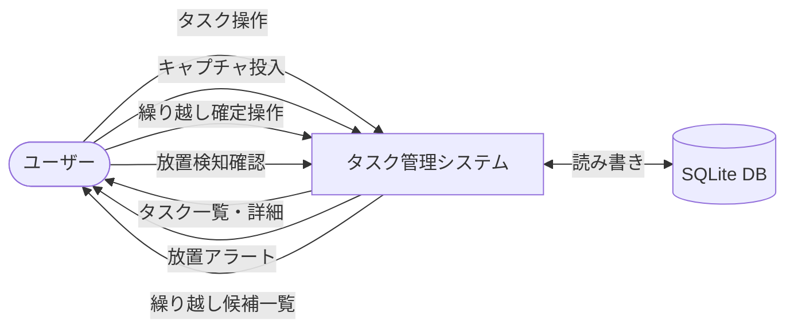
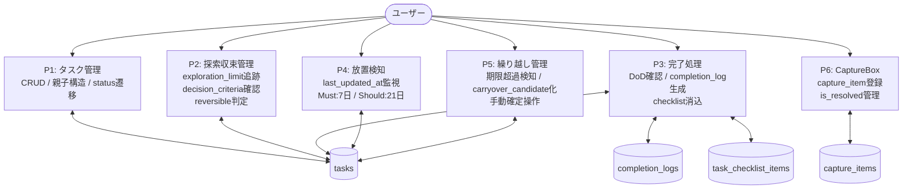
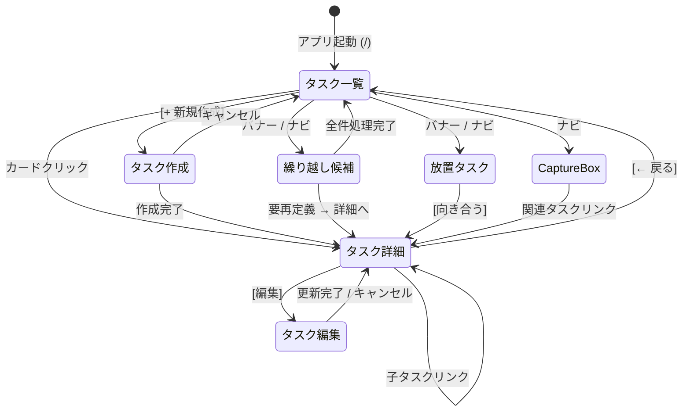
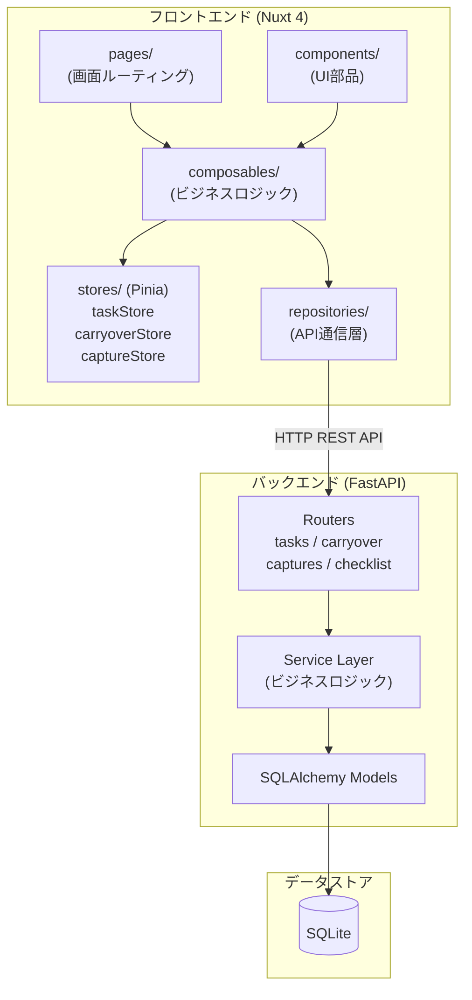
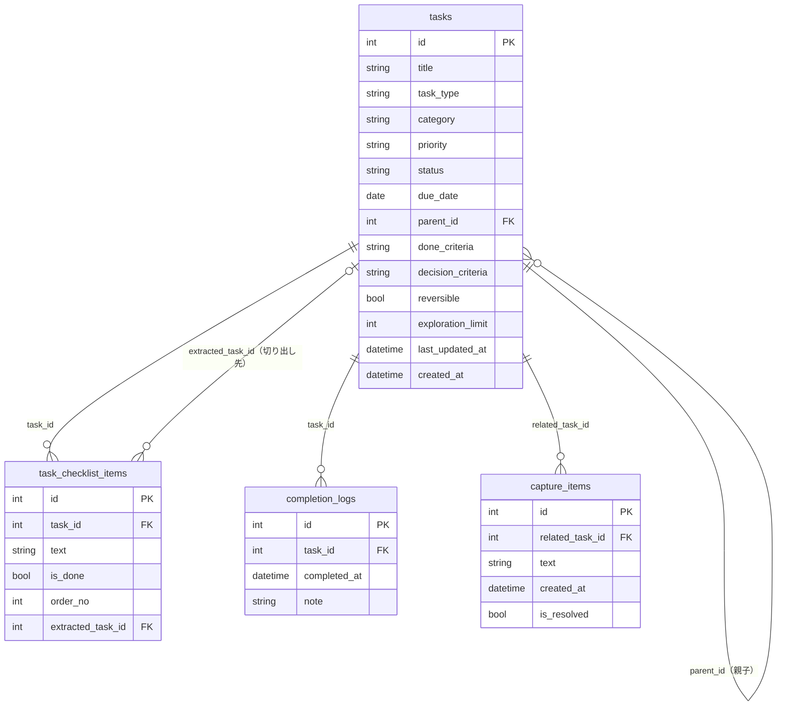

# タスク管理システム 設計概要書

バージョン: 1.1 | 作成日: 2026-02-26 | 最終更新: 2026-03-05

---

## 目次

1. [DFD（データフロー図）](#1-dfdデータフロー図)
2. [画面遷移図](#2-画面遷移図)
3. [採用技術選定](#3-採用技術選定)
4. [アーキテクチャ構成設計](#4-アーキテクチャ構成設計)
5. [外部IF設計](#5-外部if設計)
6. [テスト設計](#6-テスト設計)
7. [運用設計](#7-運用設計)
8. [監視設計](#8-監視設計)

---

## 1. DFD（データフロー図）

### 1.1 目的

システム内のデータの流れを可視化し、プロセスとデータストアの関係を明確にする。

### 1.2 スコープ

v0.1スコープ。外部システム連携・チーム共有・通知機能は対象外。

### 1.3 レベル0（コンテキスト図）


```mermaid
flowchart LR
    U([ユーザー])

    U -->|タスク操作| S[タスク管理システム]
    U -->|キャプチャ投入| S
    U -->|繰り越し確定操作| S
    U -->|放置検知確認| S

    S -->|タスク一覧・詳細| U
    S -->|放置アラート| U
    S -->|繰り越し候補一覧| U

    S <-->|読み書き| DB[(SQLite DB)]
```

### 1.4 レベル1（主要プロセス分解）


```mermaid
flowchart TB
    U([ユーザー])

    U --> P1
    U --> P2
    U --> P3
    U --> P4
    U --> P5
    U --> P6

    P1["P1: タスク管理\nCRUD / 親子構造 / status遷移"]
    P2["P2: 探索収束管理\nexploration_limit追跡\ndecision_criteria確認\nreversible判定"]
    P3["P3: 完了処理\nDoD確認 / completion_log生成\nchecklist消込"]
    P4["P4: 放置検知\nlast_updated_at監視\nMust:7日 / Should:21日"]
    P5["P5: 繰り越し管理\n期限超過検知 / carryover_candidate化\n手動確定操作"]
    P6["P6: CaptureBox\ncapture_item登録\nis_resolved管理"]

    P1 <--> DS1[(tasks)]
    P2 <--> DS1
    P3 <--> DS1
    P3 <--> DS2[(completion_logs)]
    P3 <--> DS3[(task_checklist_items)]
    P4 <--> DS1
    P5 <--> DS1
    P6 <--> DS4[(capture_items)]
```

### 1.4 制約・前提条件

- 外部エンティティはユーザーのみ（単一ユーザー前提）
- `carryover_candidate` および `stale` はDBステータスではなく動的計算で判定

---

## 2. 画面遷移図

### 2.1 目的

画面間のナビゲーションフローを可視化し、ルーティング設計の根拠とする。

### 2.2 スコープ

Nuxt 4 pagesディレクトリで管理される全画面。

### 2.3 遷移図


```mermaid
stateDiagram-v2
    [*] --> タスク一覧: アプリ起動 (/)

    タスク一覧 --> タスク作成: [+ 新規作成]
    タスク一覧 --> タスク詳細: カードクリック
    タスク一覧 --> 繰り越し候補: バナー / ナビ
    タスク一覧 --> 放置タスク: バナー / ナビ
    タスク一覧 --> CaptureBox: ナビ

    タスク作成 --> タスク一覧: キャンセル
    タスク作成 --> タスク詳細: 作成完了

    タスク詳細 --> タスク編集: [編集]
    タスク詳細 --> タスク一覧: [← 戻る]
    タスク詳細 --> タスク詳細: 子タスクリンク

    タスク編集 --> タスク詳細: 更新完了 / キャンセル

    繰り越し候補 --> タスク一覧: 全件処理完了
    繰り越し候補 --> タスク詳細: 要再定義 → 詳細へ

    放置タスク --> タスク詳細: [向き合う]

    CaptureBox --> タスク詳細: 関連タスクリンク
```

### 2.4 画面一覧サマリー

| 画面 | パス | 役割 |
|------|------|------|
| タスク一覧 | `/` | メイン画面。放置・繰り越しバナー通知 |
| タスク作成 | `/tasks/new` | 新規登録フォーム |
| タスク詳細 | `/tasks/[id]` | 詳細・チェックリスト・子タスク・CaptureBox |
| タスク編集 | `/tasks/[id]/edit` | 編集フォーム |
| 繰り越し候補 | `/carryover` | 期限超過タスクの4アクション処理 |
| 放置タスク | `/stale` | Must/Shouldセクション別表示 |
| CaptureBox | `/capture` | 分岐論点の投入・解決済み管理 |

### 2.5 制約・前提条件

- 認証画面はv0.1スコープ外
- モバイル対応は将来拡張

---

## 3. 採用技術選定

### 3.1 目的

要件に基づき技術スタックを選定し、選定理由を記録する。

### 3.2 スコープ

v0.1のフロントエンド・バックエンド・DB・開発環境。

### 3.3 技術スタック一覧

| レイヤー | 採用技術 | 選定理由 |
|---------|---------|---------|
| フロントエンド | Nuxt 4 | Vue 3ベースのフルスタックフレームワーク。ファイルベースルーティングにより画面追加が容易 |
| UIライブラリ | Nuxt UI（Tailwindベース） | Nuxt公式UI。Tailwindとの親和性が高く、デザイン一貫性を保ちやすい |
| 状態管理 | Pinia | Vue 3公式推奨。軽量でTypeScriptサポートが優秀。Vuexより記述量が少ない |
| API通信 | Repositoryパターン（$fetch） | 通信層とビジネスロジック層を分離。テスタビリティ・保守性が高い |
| 言語 | TypeScript | 型安全により実行前のバグ検出が可能。複雑なタスク状態管理に適している |
| バックエンド | FastAPI（Python） | 型ヒント・自動OpenAPI生成・非同期対応。SQLAlchemy連携が容易 |
| DB | SQLite | 単一ユーザー前提のシンプル構成。ファイルベースで環境依存なし |
| ORM/マイグレーション | SQLAlchemy + Alembic | FastAPIとの組み合わせがデファクト。将来のRDB移行も容易 |

### 3.4 将来拡張時の技術移行方針

| 現在 | 移行先 | トリガー |
|------|-------|---------|
| SQLite | PostgreSQL / MySQL | チーム共有・データ量増加時 |
| 認証なし | JWT認証 | マルチユーザー化時 |
| ローカル起動 | Docker + クラウドデプロイ | Docker 対応済み（`docker_design.md` 参照）。クラウドデプロイは可用性要件が生まれた時 |

### 3.5 制約・前提条件

- チーム共有・外部連携・通知はv0.1対象外のため、対応する技術選定はTBD

---

## 4. アーキテクチャ構成設計

### 4.1 目的

システム全体の構成を可視化し、各コンポーネントの責務と関係を明確にする。

### 4.2 スコープ

v0.1のローカル動作環境。インフラ・クラウドはスコープ外。

### 4.3 全体構成図


```mermaid
graph TB
    subgraph Frontend["フロントエンド (Nuxt 4)"]
        Pages["pages/\n(画面ルーティング)"]
        Components["components/\n(UI部品)"]
        Composables["composables/\n(ビジネスロジック)"]
        Stores["stores/ (Pinia)\ntaskStore\ncarryoverStore\ncaptureStore"]
        Repositories["repositories/\n(API通信層)"]
    end

    subgraph Backend["バックエンド (FastAPI)"]
        Router["Routers\ntasks / carryover\ncaptures / checklist"]
        Service["Service Layer\n(ビジネスロジック)"]
        Models["SQLAlchemy Models"]
    end

    subgraph DB["データストア"]
        SQLite[(SQLite)]
    end

    Pages --> Composables
    Components --> Composables
    Composables --> Stores
    Composables --> Repositories
    Repositories -->|HTTP REST API| Router
    Router --> Service
    Service --> Models
    Models --> SQLite
```

### 4.4 呼び出しフロー

```
pages/components
  → composables（ビジネスロジック・エラーハンドリング）
    → repositories（HTTP通信のみ）
      → FastAPI Routers
        → Service Layer（DB操作・バリデーション）
          → SQLAlchemy Models
            → SQLite
```

### 4.5 ディレクトリ構成概要

**フロントエンド（frontend/）**

```
pages/          # ルーティング（index, tasks/[id], carryover, stale, capture）
components/     # task/, checklist/, carryover/, capture/, common/
composables/    # useTask, useChecklist, useCarryover, useStale, useCapture
stores/         # taskStore, carryoverStore, captureStore
repositories/   # taskRepository, checklistRepository, carryoverRepository, captureRepository
types/          # Task, Checklist, Carryover, Capture
utils/          # staleThreshold.ts（放置判定）, dateFormat.ts, apiBase.ts（SSR/CSR URL切り替え）
```

**バックエンド（backend/）**

```
api/            # tasks.py, carryover.py, captures.py, checklist.py
services/       # task_service.py, carryover_service.py, capture_service.py
models/         # task.py, completion_log.py, checklist_item.py, capture_item.py
schemas/        # Pydantic スキーマ
db/             # base.py, session.py（セッション管理）
core/           # config.py（環境変数: DATABASE_URL, CORS_ORIGINS, LOG_LEVEL, WORKERS）
```

### 4.6 制約・前提条件

- フロントエンドとバックエンドは別プロセスで起動（ポート分離）
- CORS設定はローカル開発環境前提（本番化時の設定方針は `docker_design.md` §8 参照）
- Viteの開発サーバーはホストブロッキングが有効（`allowedHosts` 設定で同一ネットワーク内アクセスを制御）
- 単一ユーザー前提のためセッション管理は不要

---

## 5. 外部IF設計

### 5.1 目的

フロントエンド・バックエンド間のAPI通信仕様を定義する。

### 5.2 スコープ

v0.1のREST API（内部通信のみ）。外部サービス連携はスコープ外。

### 5.3 通信仕様

| 項目 | 内容 |
|------|------|
| プロトコル | HTTP（ローカル開発）/ HTTPS（本番化時） |
| データ形式 | JSON |
| 認証 | なし（v0.1は単一ユーザー前提） |
| ベースURL（開発） | `http://localhost:8000` |
| APIドキュメント | `http://localhost:8000/docs`（FastAPI自動生成） |

### 5.4 エラーレスポンス形式

```json
{
  "detail": "エラーメッセージ"
}
```

### 5.5 制約・前提条件

- API仕様の詳細（エンドポイント・スキーマ）は `backend_design.md` を参照
- v0.1は認証ヘッダー不要。マルチユーザー化時にJWT Bearer認証を追加予定

---

## 6. テスト設計

### 6.1 目的

品質担保のためのテスト方針・レベル・優先ケースを定義する。

### 6.2 スコープ

v0.1のバックエンドAPIテスト・サービス層ユニットテスト。フロントエンドE2Eは将来対応。

### 6.3 テスト方針

- 重要ビジネスロジック（完了処理・繰り越し・放置検知）を優先してテスト
- 動的計算ロジック（stale判定・carryover_candidate判定）は必須テスト対象
- PATCH経由done禁止などのガード系バリデーションを必ずテスト

### 6.4 テストレベル

| テストレベル | ツール | 対象 | 優先度 |
|------------|-------|------|-------|
| ユニットテスト | pytest | サービス層ロジック（完了処理・放置判定・探索収束） | 高 |
| APIテスト | pytest + httpx | 全エンドポイント（正常系・異常系） | 高 |
| フロントE2E | （将来：Playwright） | 主要ユーザーフロー | 低（将来対応） |

### 6.5 優先テストケース

**完了処理（P3）**

| テストケース | 期待結果 |
|------------|---------|
| チェックリスト全完了でcomplete実行 | 201・completion_log生成 |
| チェックリスト未完了でcomplete実行 | 400エラー |
| PATCH経由でstatus=done指定 | 400エラー |

**放置検知（P4）**

| テストケース | 期待結果 |
|------------|---------|
| must タスク・last_updated_at = 8日前 | stale一覧に含まれる |
| must タスク・last_updated_at = 6日前 | stale一覧に含まれない |
| should タスク・last_updated_at = 22日前 | stale一覧に含まれる |

**繰り越し管理（P5）**

| テストケース | 期待結果 |
|------------|---------|
| due_date超過タスクのGET /carryover-candidates | 対象タスクが返る |
| action=today でcarryover確定 | due_date=当日・status=todo |
| action=plus_2d でcarryover確定 | due_date+=2・status=todo |
| action=needs_redefine でcarryover確定 | status=needs_redefine |

**探索収束（P2）**

| テストケース | 期待結果 |
|------------|---------|
| exploration_limit=3・子タスク2件 | exploration_remaining=1 |
| reversible=true確認済 | convergence_checklist.reversible_confirmed=true |

### 6.6 未決事項・TODO

- フロントエンドのcomposables単体テスト設計（将来）
- テストデータ（fixture）管理方針の確定

---

## 7. 運用設計

### 7.1 目的

v0.1ローカル運用における起動・バックアップ・障害対応の方針を定義する。

### 7.2 スコープ

単一ユーザー・ローカル環境。クラウドデプロイはスコープ外。

### 7.3 起動・停止手順

**Docker Compose（推奨）**

```bash
# 初回セットアップ
cp .env.example .env.dev

# ビルド＆起動（開発環境）
docker compose -f docker-compose.yml -f docker-compose.dev.yml --env-file .env.dev up -d

# 停止
docker compose down
```

> 詳細手順・本番環境起動・マイグレーション操作は `docker_design.md` §10 を参照。

**ローカル直接起動（Docker なし）**

```bash
# バックエンド起動
cd backend && .venv/bin/uvicorn main:app --reload --port 8000

# フロントエンド起動
cd frontend && npm run dev

# アクセス
http://localhost:3000
```

### 7.4 データバックアップ方針

| 項目 | 方針 |
|------|------|
| 対象 | `backend/data/tasks.db`（SQLiteファイル） |
| 頻度 | 手動（作業前後） |
| 方法 | ファイルコピー（`cp tasks.db tasks.db.bak.YYYYMMDD`） |
| 保管 | ローカルの別ディレクトリまたはクラウドストレージ |

### 7.5 マイグレーション運用

```bash
# マイグレーション適用
cd backend
alembic upgrade head

# ロールバック（1ステップ前）
alembic downgrade -1

# 現在のリビジョン確認
alembic current
```

### 7.6 障害対応方針

| 障害 | 対応 |
|------|------|
| バックエンドが起動しない | ログ確認・ポート競合チェック（`lsof -i :8000`） |
| DBファイル破損 | バックアップから復元 |
| フロントエンドビルドエラー | `node_modules`削除・再インストール |

### 7.7 セキュリティ方針

#### 基本原則

- 秘密情報（APIキー・パスワード等）はコードに埋め込まない。`.env` ファイルで管理し、`.gitignore` に追加する（`.env.example` のみコミット対象）
- 入力バリデーションはFastAPI（Pydantic）のスキーマを唯一の防衛線とし、スキーマ定義外の値はリクエスト受付時点で拒否する
- SQLインジェクションはSQLAlchemy ORM経由のクエリ発行により防止する（生SQLは使用しない）

#### v0.1で対応する項目

| 項目 | 方針 |
|------|------|
| CORS | ローカル開発は `localhost:3000` のみ許可。本番化時は `CORS_ORIGINS` 環境変数で制御（`docker_design.md` §8 参照） |
| SQLiteファイルのパーミッション | `tasks.db` のファイルパーミッションを `600`（所有者のみ読み書き）に設定する |
| Viteホストブロッキング | 開発サーバーへの同一ネットワーク内アクセスは `allowedHosts` で明示的に許可する（デフォルトはlocalhost限定） |
| 秘密情報管理 | `.env` / `.env.dev` / `.env.prod` は `.gitignore` 対象。`.env.example` のみをコミットする |

#### 本番化時に対応する項目（TBD）

| 項目 | 対応方針 |
|------|---------|
| HTTPS強制 | Nginxリバースプロキシを前段に配置し、HTTPからHTTPSへリダイレクト |
| レート制限 | SlowAPI（FastAPI用）の導入を検討 |
| セキュリティヘッダー | `X-Content-Type-Options`・`X-Frame-Options` 等をNginxで付与 |
| 依存パッケージ脆弱性チェック | `pip-audit`（バックエンド）・`npm audit`（フロントエンド）を本番化前に実施 |
| backendポートの非公開 | 本番環境ではbackend（:8000）をホストに直接公開しない。Nginxリバースプロキシ経由に限定する（`docker_design.md` §11 参照） |

### 7.8 制約・前提条件

- v0.1は常時稼働不要（必要時に手動起動）
- ログ永続化・自動起動はv0.1スコープ外

---

## 8. 監視設計

### 8.1 目的

v0.1の最小限の監視方針を定義する。本格的な監視基盤は将来拡張とする。

### 8.2 スコープ

ローカル動作確認レベルの監視。外部監視サービスはスコープ外。

### 8.3 ヘルスチェック

FastAPIのデフォルト機能またはシンプルなエンドポイントで確認する。

```python
# main.py に追加
@app.get("/health")
def health():
    return {"status": "ok"}
```

アクセス確認：`curl http://localhost:8000/health`

### 8.4 ログ方針

| 対象 | 出力先 | 内容 |
|------|-------|------|
| FastAPI | 標準出力 | リクエストログ（uvicornデフォルト） |
| SQLAlchemy | 標準出力 | SQLログ（開発時のみ `echo=True`） |
| Nuxt 4 | ブラウザコンソール | クライアントエラー・API通信エラー |

### 8.5 将来の監視拡張（TBD）

クラウドデプロイ・チーム共有化時に以下を検討する。

| 監視項目 | ツール候補 |
|---------|---------|
| アプリケーションログ | Datadog / CloudWatch / Loki |
| エラー追跡 | Sentry |
| パフォーマンス監視 | Prometheus + Grafana |
| アップタイム監視 | UptimeRobot |

### 8.6 制約・前提条件

- v0.1はSLA要件なし（個人利用のため）
- アラート通知はv0.1スコープ外

---

## 付録：データモデル概要（ER図）


```mermaid
erDiagram
    tasks {
        int id PK
        string title
        string task_type
        string category
        string priority
        string status
        date due_date
        int parent_id FK
        string done_criteria
        string decision_criteria
        bool reversible
        int exploration_limit
        datetime last_updated_at
        datetime created_at
    }

    task_checklist_items {
        int id PK
        int task_id FK
        string text
        bool is_done
        int order_no
        int extracted_task_id FK
    }

    completion_logs {
        int id PK
        int task_id FK
        datetime completed_at
        string note
    }

    capture_items {
        int id PK
        int related_task_id FK
        string text
        datetime created_at
        bool is_resolved
    }

    tasks ||--o{ tasks : "parent_id（親子）"
    tasks ||--o{ task_checklist_items : "task_id"
    tasks ||--o{ completion_logs : "task_id"
    tasks ||--o{ capture_items : "related_task_id"
    task_checklist_items }o--o| tasks : "extracted_task_id（切り出し先）"
```